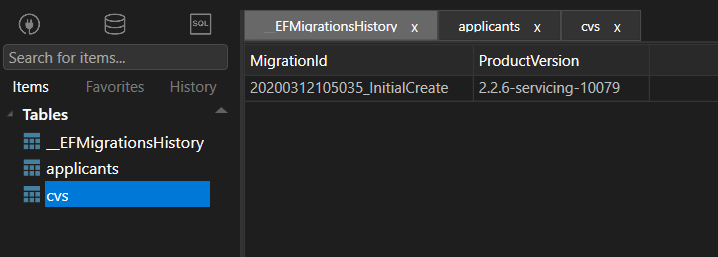

Getting started with Entity Framework Core provider for Cassandra
=================================================================

.. note:: Sample project can be found on this url_.

Install the nuget package
-------------------------

Create an empty DOTNET CORE project and install the nuget package ``EFCore.Cassandra``.
Similarly to any EFCore project, create a class which inherits ``DbContext`` and add models.

Configure DbContext
-------------------

Open the ``DbContext`` implementation, override the ``OnConfiguring`` method and configure database access::

    optionsBuilder.UseCassandra("Contact Points=127.0.0.1;", opt =>
    {
      opt.MigrationsHistoryTable(HistoryRepository.DefaultTableName, "<schema name>");
    });

Configure keyspaces
^^^^^^^^^^^^^^^^^^^

**Definition** : A keyspace in Cassandra is a namespace that defines data replication on nodes. A cluster contains one keyspace per node.

In order to configure a keyspace, open the ``DbContext`` implementation and insert the following line in the ``OnModelCreating`` method::

    modelBuilder.ForCassandraAddKeyspace("<keyspace name>", KeyspaceReplicationSimpleStrategyClass());

This method contains two parameters:

- Keyspace name.
- Replication strategy.

There are two replication strategies:

- **KeyspaceReplicationSimpleStrategyClass** : Use only for a single datacenter and one rack.
- **KeyspaceReplicationNetworkTopologyStrategyClass** : Use when you have your cluster deployed across multiple datacenters.

Configure tables
^^^^^^^^^^^^^^^^

**Definition** : data is stored in tables containing rows of columns, similar to SQL definitions.

In order to configure one table, open the ``DbContext`` implementation and insert the following line in the ``OnModelCreating`` method::

    modelBuilder.Entity<Applicant>()
      .ToTable("applicants", "cv")
      .HasKey(p => new { p.Id, p.LastName });
    modelBuilder.Entity<Applicant>()
      .ForCassandraSetClusterColumns(s => new { s.LastName });

The method ``ToTable`` contains two parameters::

- Table name.
- Keyspace name.

Add migrations
--------------

Once the ``DbContext`` implementation is configured, run the command ``dotnet ef migrations add InitialCreate`` to add migration scripts.
Run the command ``dotnet ef database update`` to deploy the migration scripts.

With the TablePlus_ tool  you should see something like this:

CRUD operations
---------------

Once everything is set up, you can start playing with the ``DbContext``, use LINQ to run operations like ``Create``, ``Delete``, ``Update`` or ``Select``::

    using (var dbContext = new FakeDbContext())
    {
      dbContext.Applicants.Add(BuildApplicant());
      dbContext.SaveChanges();
    }

.. _url: https://github.com/simpleidserver/EFCore.Cassandra/tree/master/samples/EFCore.Cassandra.Samples
.. _TablePlus: https://tableplus.com/